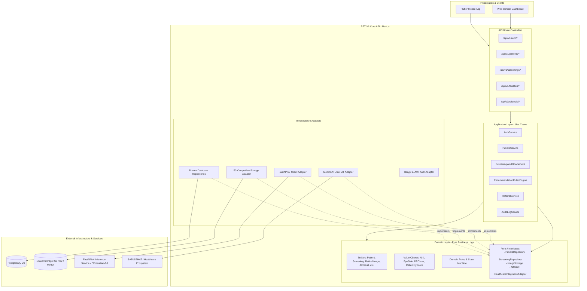
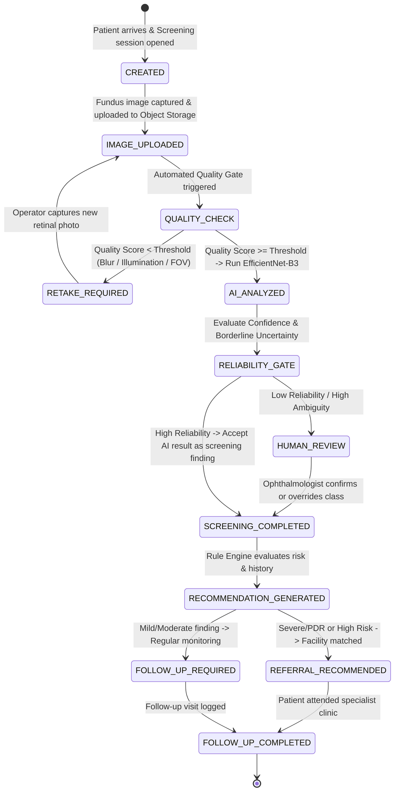

# RETIVA Architectural Blueprint & System Design

> **"Retiva harus menjadi provider-agnostic dan healthcare-ready."**

Dokumen ini mendefinisikan arsitektur teknis, boundary sistem, kontrak domain, model database, alur ketergantungan, serta strategi decoupling provider untuk platform **RETIVA** (AI-assisted diabetic retinopathy screening).

---

## 1. Ringkasan Arsitektur

RETIVA dirancang menggunakan pendekatan **Clean Architecture / Hexagonal Architecture (Ports and Adapters)** yang dimodularisasi dalam arsitektur **Modular Monolith + Dedicated AI Microservice**:

1. **Modular Monolith (Web & Core API)**:
   - Menggunakan **Next.js (TypeScript)** dengan App Router untuk REST API.
   - Terdiri dari 3 layer utama: **Domain Layer**, **Application Layer (Use Cases)**, dan **Infrastructure Adapters**.
   - Bertindak sebagai *Clinical Workflow Orchestrator*, pengelola otentikasi/RBAC, repositori rekam medis screening, recommendation engine, audit trail, serta API Gateway bagi client (Flutter Mobile & Web Portal).
2. **Dedicated AI Microservice (Inference Engine)**:
   - Menggunakan **FastAPI (Python)** dengan model **EfficientNet-B3** (5-class Diabetic Retinopathy).
   - Memiliki 2 pipeline ketat: **Image Quality Gate** (sebelum inferensi) dan **Reliability Gate** (setelah inferensi).
   - Tidak pernah diakses langsung oleh client/frontend; seluruh komunikasi melalui `AIClient` adapter dari Core API dengan authenticated internal mTLS / secret token.
3. **Decoupled Infrastructure**:
   - Seluruh I/O eksternal (PostgreSQL via Prisma, Object Storage via S3 abstraction, AI Service via HTTP, Notification, SATUSEHAT/JKN integration) dibungkus dalam *Interface Ports* sehingga implementasi provider dapat diganti kapan saja tanpa mengubah domain logic.

---

## 2. Dependency Flow (Aliran Ketergantungan)

Prinsip utama: **Inward Dependency Rule**. Layer dalam (Domain) tidak boleh memiliki ketergantungan (import) ke layer luar (Application, Infrastructure, maupun Framework).



---

## 3. Struktur Monorepo

```text
retiva/
├── mobile/                                 # Flutter Client Application
│   ├── lib/
│   │   ├── core/                           # Network, Theme, State base
│   │   ├── features/
│   │   │   ├── auth/
│   │   │   ├── patient/
│   │   │   ├── screening/                  # Camera & fundus capture
│   │   │   └── history/
│   │   └── main.dart
│   └── pubspec.yaml
│
├── web/                                    # RETIVA Core Backend & Admin Web (Next.js)
│   ├── app/                                # Next.js App Router
│   │   └── api/
│   │       └── v1/                         # Versioned REST API
│   │           ├── auth/                   # Register, Login, Me
│   │           ├── patients/               # CRUD Patient, List, Search
│   │           │   └── [id]/
│   │           │       └── diabetes-profile/
│   │           ├── diabetes-profiles/      # Standalone Diabetes Profile access
│   │           ├── screenings/             # Workflow: upload, quality, analyze
│   │           │   └── [id]/
│   │           │       ├── images/
│   │           │       └── analyze/
│   │           ├── reviews/                # Human Review by Ophthalmologist
│   │           ├── recommendations/        # Rules-based Clinical Recommendations
│   │           ├── facilities/             # Healthcare Facility Directory & Matching
│   │           ├── referrals/              # Referral Letter & BPJS Routing
│   │           ├── follow-ups/             # Patient Follow-up Scheduling & Tracking
│   │           ├── history/                # Patient Longitudinal Screening History
│   │           └── models/                 # Model Registry & Active Version Info
│   │
│   ├── domain/                             # PURE DOMAIN LAYER (Zero external framework imports)
│   │   ├── auth/                           # User, Role, PasswordHasher interface
│   │   ├── patient/                        # Patient, DiabetesProfile, PatientRepository
│   │   ├── screening/                      # Screening, RetinalImage, QualityCheck, AIResult,
│   │   │                                   # ReliabilityAssessment, ScreeningRepository
│   │   ├── recommendation/                 # Recommendation, RecommendationEngine interface
│   │   ├── referral/                       # Referral, ReferralRepository
│   │   ├── follow-up/                      # FollowUp, FollowUpRepository
│   │   ├── facility/                       # Facility, FacilityService, FacilityInsurance
│   │   ├── model-version/                  # ModelVersion entity & metadata
│   │   ├── audit/                          # AuditLog entity & AuditRepository interface
│   │   └── common/                         # BaseEntity, Result, DomainError, ValueObject
│   │
│   ├── application/                        # APPLICATION USE CASES (Orchestration)
│   │   ├── auth/                           # RegisterUser, LoginUser, VerifyToken
│   │   ├── patient/                        # RegisterPatient, UpdateProfile, GetHistory
│   │   ├── screening/                      # InitiateScreening, ProcessQualityGate,
│   │   │                                   # ExecuteAIInference, SubmitHumanReview
│   │   ├── recommendation/                 # GenerateRecommendationRules
│   │   ├── referral/                       # CreateReferral, MatchFacility
│   │   └── follow-up/                      # ScheduleFollowUp, CompleteFollowUp
│   │
│   ├── infrastructure/                     # INFRASTRUCTURE ADAPTERS (External implementations)
│   │   ├── database/
│   │   │   ├── prisma/                     # Prisma Client instance & config
│   │   │   └── repositories/               # Prisma implementations of Domain Repositories
│   │   ├── storage/                        # S3CompatibleStorage (AWS S3, MinIO, R2)
│   │   ├── ai/                             # FastAPIAIClient (HTTP adapter to Python service)
│   │   ├── notifications/                  # WhatsApp / SMS / Email adapter interface
│   │   ├── healthcare/                     # SATUSEHAT & JKN mock/real adapters
│   │   └── security/                       # Bcrypt & JWT token utilities
│   │
│   ├── prisma/
│   │   ├── schema.prisma                   # PostgreSQL Complete ERD Schema
│   │   └── migrations/
│   ├── lib/                                # Shared utilities, configs, HTTP response helpers
│   ├── package.json
│   └── tsconfig.json
│
├── ai-service/                             # Python AI Inference Service (FastAPI)
│   ├── app/
│   │   ├── api/                            # Endpoints: /quality-check, /screen, /explainability
│   │   ├── models/                         # EfficientNet-B3 PyTorch/ONNX wrapper
│   │   ├── services/                       # Image Preprocessing, Quality Assessor, Reliability Gate
│   │   ├── schemas/                        # Pydantic Request & Response DTOs
│   │   └── config.py                       # Threshold configs (versioned)
│   ├── models/
│   │   └── efficientnet_b3/                # Model weights metadata & checkpoints
│   ├── tests/                              # Pytest test cases
│   ├── requirements.txt
│   └── Dockerfile
│
├── docs/                                   # Project Documentation
│   ├── architecture/                       # Architecture decisions, diagrams, specs
│   ├── api/                                # OpenAPI / Swagger specs & guides
│   └── security/                           # Threat model, HIPAA/Indonesian PDP compliance
│
├── docker-compose.yml                      # Local full-stack runtime (Postgres, MinIO, AI, Web)
└── README.md
```

---

## 4. Database ERD Konseptual (16 Domain)

Fundus image **TIDAK PERNAH** disimpan sebagai BLOB di database; database hanya menyimpan `storage_key` yang merujuk pada secure object storage.

```mermaid
erDiagram
    USER ||--o| PATIENT : "belongs to (role=PATIENT)"
    USER ||--o{ SCREENING : "conducted by (role=HEALTHCARE_WORKER)"
    USER ||--o{ HUMAN_REVIEW : "reviewed by (role=OPHTHALMOLOGIST)"
    USER ||--o{ AUDIT_LOG : "triggered by"

    PATIENT ||--|| DIABETES_PROFILE : "has"
    PATIENT ||--o{ SCREENING : "undergoes"
    PATIENT ||--o{ REFERRAL : "receives"
    PATIENT ||--o{ FOLLOW_UP : "scheduled for"

    SCREENING ||--|{ RETINAL_IMAGE : "contains (OD/OS)"
    RETINAL_IMAGE ||--o| QUALITY_CHECK : "evaluated by"
    SCREENING ||--o| AI_RESULT : "inferred as"
    SCREENING ||--o| RELIABILITY_ASSESSMENT : "verified by"
    SCREENING ||--o| HUMAN_REVIEW : "adjudicated by"
    SCREENING ||--o| RECOMMENDATION : "produces"
    SCREENING ||--o| REFERRAL : "triggers"
    SCREENING ||--o{ FOLLOW_UP : "initiates"

    MODEL_VERSION ||--o{ AI_RESULT : "generated by model version"
    FACILITY ||--o{ FACILITY_SERVICE : "provides"
    FACILITY ||--o{ FACILITY_INSURANCE : "accepts"
    FACILITY ||--o{ REFERRAL : "targeted by"

    USER {
        string id PK
        string email UK
        string password_hash
        string role "PATIENT | HEALTHCARE_WORKER | OPHTHALMOLOGIST | ADMIN"
        string full_name
        string facility_id FK
        datetime created_at
    }

    PATIENT {
        string id PK
        string user_id FK
        string nik UK "Nomor Induk Kependudukan (16 digit)"
        string full_name
        date birth_date
        string gender "MALE | FEMALE"
        string phone
        string address
        datetime created_at
    }

    DIABETES_PROFILE {
        string id PK
        string patient_id FK
        string diabetes_type "TYPE_1 | TYPE_2 | GESTATIONAL | UNKNOWN"
        int year_of_diagnosis
        string current_treatment "INSULIN | ORAL_MEDICATION | DIET_ONLY | NONE"
        float last_hba1c
        date last_hba1c_date
        int systolic_bp
        int diastolic_bp
        boolean smoker
        datetime updated_at
    }

    SCREENING {
        string id PK
        string patient_id FK
        string conducted_by_id FK
        string facility_id FK
        string status "CREATED | IMAGE_UPLOADED | QUALITY_CHECK | RETAKE_REQUIRED | AI_ANALYZED | HUMAN_REVIEW | SCREENING_COMPLETED | FOLLOW_UP_REQUIRED | REFERRAL_RECOMMENDED | FOLLOW_UP_COMPLETED"
        string current_step
        json metadata
        datetime created_at
        datetime updated_at
    }

    RETINAL_IMAGE {
        string id PK
        string screening_id FK
        string eye "OD (Right) | OS (Left)"
        string storage_key "object storage key, not blob"
        string mime_type
        string checksum "SHA-256 integrity hash"
        datetime uploaded_at
    }

    QUALITY_CHECK {
        string id PK
        string retinal_image_id FK
        boolean passed
        float blur_score
        float illumination_score
        float fov_score
        string retake_reason "BLURRY | TOO_DARK | TOO_BRIGHT | INSUFFICIENT_FOV | OTHER"
        datetime checked_at
    }

    MODEL_VERSION {
        string id PK
        string model_name "efficientnet-b3"
        string version "v1.0.0"
        string pipeline_version
        string weights_hash
        boolean is_active
        datetime deployed_at
    }

    AI_RESULT {
        string id PK
        string screening_id FK
        string model_version_id FK
        string predicted_class "NO_DR | MILD_DR | MODERATE_DR | SEVERE_DR | PROLIFERATIVE_DR"
        float confidence
        json raw_probabilities
        datetime inference_timestamp
    }

    RELIABILITY_ASSESSMENT {
        string id PK
        string screening_id FK
        string status "ANALYZE | HUMAN_REVIEW | RETAKE"
        float score
        float confidence_threshold
        float quality_threshold
        datetime assessed_at
    }

    HUMAN_REVIEW {
        string id PK
        string screening_id FK
        string reviewer_id FK
        string review_status "PENDING | CONFIRMED | OVERRIDDEN"
        string confirmed_class
        string clinical_notes
        datetime reviewed_at
    }

    RECOMMENDATION {
        string id PK
        string screening_id FK
        string summary
        string recommended_action "ROUTINE_ANNUAL | 6_MONTH_FOLLOW_UP | SPECIALIST_REFERRAL | URGENT_CARE"
        string urgency_level "LOW | MEDIUM | HIGH | CRITICAL"
        boolean referral_indicated
        datetime generated_at
    }

    FACILITY {
        string id PK
        string name
        string address
        float latitude
        float longitude
        string bpjs_status "ACCEPTED | NOT_AVAILABLE | NEEDS_CONFIRMATION"
        boolean is_verified
        string contact_phone
    }

    FACILITY_SERVICE {
        string id PK
        string facility_id FK
        string service_name "RETINA_SPECIALIST | LASER_PHOTOCOAGULATION | VITRECTOMY"
    }

    FACILITY_INSURANCE {
        string id PK
        string facility_id FK
        string insurance_name
        string status
    }

    REFERRAL {
        string id PK
        string screening_id FK
        string patient_id FK
        string target_facility_id FK
        string reason
        string clinical_summary
        string status "RECOMMENDED | ISSUED | ACCEPTED_BY_FACILITY | EXPIRED | COMPLETED"
        datetime created_at
    }

    FOLLOW_UP {
        string id PK
        string patient_id FK
        string screening_id FK
        date due_date
        string status "SCHEDULED | NOTIFIED | COMPLETED | MISSED | CANCELLED"
        string completion_notes
        datetime created_at
    }

    AUDIT_LOG {
        string id PK
        string actor_id FK
        string actor_role
        string action "PATIENT_CREATED | IMAGE_UPLOADED | AI_INFERENCE | HUMAN_REVIEW_COMPLETED | REFERRAL_ISSUED"
        string resource
        string resource_id
        json metadata
        datetime timestamp
    }
```



---

## 5. Daftar API Endpoint (RESTful & Versioned `/api/v1`)

| Method | Endpoint | Role | Deskripsi |
| :--- | :--- | :--- | :--- |
| **Auth** | | | |
| `POST` | `/api/v1/auth/register` | Public | Registrasi akun baru (Patient / Healthcare Worker) |
| `POST` | `/api/v1/auth/login` | Public | Autentikasi dan penerbitan secure JWT session token |
| `GET` | `/api/v1/auth/me` | Authenticated | Ambil profil user aktif & hak akses peran |
| **Patients** | | | |
| `POST` | `/api/v1/patients` | Worker, Admin | Registrasi data demografis pasien diabetes baru |
| `GET` | `/api/v1/patients` | Worker, Admin | Cari & filter pasien (NIK, nama, status) |
| `GET` | `/api/v1/patients/:id` | Patient (self), Worker | Ambil detail pasien berdasarkan ID |
| `PUT` | `/api/v1/patients/:id` | Worker, Admin | Perbarui data demografis pasien |
| **Diabetes Profiles** | | | |
| `GET` | `/api/v1/patients/:id/diabetes-profile` | Patient (self), Worker | Ambil riwayat diabetes (HbA1c, tahun diagnosis, terapi) |
| `POST` | `/api/v1/patients/:id/diabetes-profile` | Worker, Admin | Buat / update profil diabetes pasien |
| **Screenings** | | | |
| `POST` | `/api/v1/screenings` | Worker | Inisiasi sesi screening baru |
| `GET` | `/api/v1/screenings/:id` | Patient (self), Worker | Ambil status screening lengkap beserta alur state |
| `POST` | `/api/v1/screenings/:id/images` | Worker | Upload citra fundus (OD/OS) & simpan metadata storage key |
| `POST` | `/api/v1/screenings/:id/quality-check`| Worker | Eksekusi Image Quality Gate via AI adapter |
| `POST` | `/api/v1/screenings/:id/analyze` | Worker | Trigger AI DR Classification & Reliability Gate |
| **Human Reviews** | | | |
| `GET` | `/api/v1/reviews/pending` | Ophthalmologist | Ambil antrean screening yang butuh human review |
| `POST` | `/api/v1/reviews/:screeningId` | Ophthalmologist | Konfirmasi atau override hasil AI beserta catatan klinis |
| **Recommendations**| | | |
| `GET` | `/api/v1/recommendations/:screeningId` | Patient, Worker | Ambil rekomendasi hasil rule-engine non-diagnostik |
| **Facilities & Referral** | | | |
| `GET` | `/api/v1/facilities` | Authenticated | Cari fasilitas kesehatan retina terdekat |
| `POST` | `/api/v1/facilities/match` | Worker | Rule-based facility matching (layanan + JKN status) |
| `POST` | `/api/v1/referrals` | Worker | Terbitkan surat rekomendasi rujukan |
| `GET` | `/api/v1/referrals/:id` | Patient (self), Worker | Detail rujukan dan status JKN/BPJS |
| **Follow-ups & History** | | | |
| `GET` | `/api/v1/follow-ups` | Worker | Daftar tindak lanjut pasien aktif |
| `PUT` | `/api/v1/follow-ups/:id` | Worker | Perbarui status kunjungan tindak lanjut |
| `GET` | `/api/v1/history/patients/:patientId` | Patient (self), Worker | Longitudinal screening timeline pasien |
| **Audit & Models** | | | |
| `GET` | `/api/v1/models/active` | Authenticated | Ambil versi model aktif, hash bobot, dan threshold |
| `GET` | `/api/v1/audit-logs` | Admin | Audit trail compliance log |

---

## 6. Screening State Machine

Diagram status screening menjamin konsistensi alur klinis. Gambar yang gagal uji kualitas **tidak akan pernah** diproses untuk klasifikasi DR.



Setiap transisi status di atas memicu event audit log yang mencatat `actor_id`, `from_status`, `to_status`, `timestamp`, dan `metadata`.

---

## 7. Bagian yang Provider-Agnostic

Untuk memastikan RETIVA tidak terkunci pada vendor manapun, pemisahan dilakukan secara tegas:

1. **Domain Entities & Value Objects**:
   - `Patient`, `Screening`, `RetinalImage`, `AIResult`, `ReliabilityScore`, `Recommendation`.
   - Menggunakan TypeScript murni tanpa decorator ORM atau third-party package.
2. **Domain Repository Interfaces (Ports)**:
   - `PatientRepository`, `ScreeningRepository`, `ReferralRepository`, `FollowUpRepository`.
   - Hanya mendefinisikan kontrak operasi (misal: `create`, `findById`, `findByNik`), bukan query SQL atau Prisma syntax.
3. **Storage Abstraction (`ImageStorage`)**:
   - Kontrak: `upload(buffer, key, mimeType)`, `getSignedUrl(key, expiresIn)`, `delete(key)`, `exists(key)`.
   - Business service tidak tahu apakah file disimpan di AWS S3, Cloudflare R2, MinIO lokal rumah sakit, atau Supabase Storage.
4. **AI Inference Abstraction (`AIClient`)**:
   - Kontrak: `checkQuality(imageUrlOrKey)`, `screen(imageUrlOrKey)`, `getExplainability(screeningId)`.
   - Service screening tidak tahu apakah model berjalan di FastAPI lokal, AWS SageMaker, GCP Vertex AI, atau server on-premise rumah sakit.
5. **Healthcare Interoperability Abstraction (`HealthcareIntegrationAdapter`)**:
   - Kontrak: `syncPatientToSatuSehat(patient)`, `verifyBPJSStatus(nik)`.
   - Tahap prototype menggunakan `MockHealthcareIntegration`, siap diganti dengan `SatuSehatFHIRAdapter` resmi di masa depan tanpa mengubah kode use-case.
6. **Clinical Recommendation Engine (`RecommendationRulesEngine`)**:
   - Menggunakan pure deterministic business rules berbasis pedoman klinis (misal: Konsensus Perdami / ADA Guidelines), bukan black-box LLM atau cloud proprietary rules.

---

## 8. Strategi Migrasi Cloud/Provider Tanpa Mengubah Domain Logic

| Komponen | Saat Ini (Hackathon / Prototype) | Masa Depan (Private Healthcare / Production) | Cara Migrasi Tanpa Mengubah Domain Logic |
| :--- | :--- | :--- | :--- |
| **Database** | PostgreSQL lokal via Docker / Supabase / Neon | Managed AWS RDS / On-Premise PostgreSQL Rumah Sakit | Cukup ubah `DATABASE_URL` di environment variable. Domain logic tetap memanggil `patientRepository.findById()`. |
| **Object Storage** | Local MinIO / Cloudflare R2 (S3-compatible) | Private HIPAA-compliant Object Storage / Ceph on-premise | Adapter `S3CompatibleStorage` mendukung custom S3 endpoint, bucket, dan credentials. Cukup ubah env `STORAGE_ENDPOINT` dan `STORAGE_BUCKET`. Jika berganti protokol, cukup buat adapter baru `GCSStorageAdapter` yang mengimplementasikan `ImageStorage`. |
| **AI Inference** | FastAPI Python lokal / container | Kubernetes cluster dengan Triton Inference Server / AWS SageMaker | Buat adapter baru `TritonAIClient` yang mengimplementasikan interface `AIClient`. Ganti dependency injection di service factory. `ScreeningService` tidak berubah 1 baris pun. |
| **Hosting & Compute**| Node.js / Next.js local & Docker | Sovereign Healthcare Cloud / On-Premise Kubernetes Faskes | Aplikasi dikemas sebagai standard Docker container (`web/Dockerfile`). Tidak ada binding ke proprietary serverless API Vercel/Render/Railway. |
| **Notification** | Mock Console / Log | WhatsApp Business API (WABA) / Twilio SMS | Implementasikan interface `NotificationService` baru. Use-case tetap memanggil `notificationService.sendFollowUpReminder()`. |

---

## 9. Rencana Eksekusi Bertahap (Phased Roadmap)

- **PHASE 1 (Fondasi & Domain Pasien)**:
  - Monorepo structure, PostgreSQL + Prisma setup, Complete schema with 16 entities.
  - Authentication (JWT + Password hashing + RBAC: PATIENT, WORKER, ADMIN).
  - Patient & DiabetesProfile domain entities, repositories, application services, and REST APIs.
- **PHASE 2 (Screening & Image Pipeline)**:
  - Screening state machine, RetinalImage entity (storage-key only, no BLOB).
  - `ImageStorage` abstraction (S3-compatible) + Quality Gate workflow.
- **PHASE 3 (AI Service & Reliability Gate)**:
  - FastAPI service with EfficientNet-B3 structure, `/quality-check`, `/screen`.
  - `AIClient` adapter with versioned threshold configs and Reliability Gate.
- **PHASE 4 (Clinical Review & Care Continuity)**:
  - Human review queue & adjudication, deterministic Recommendation Engine.
  - Facility directory, facility matching, Referral generation, Follow-up tracker.
- **PHASE 5 (Production Hardening & Governance)**:
  - Immutable Audit Log trail, Model Versioning registry.
  - Security hardening, rate limiting, OpenAPI docs, and automated testing suite.
